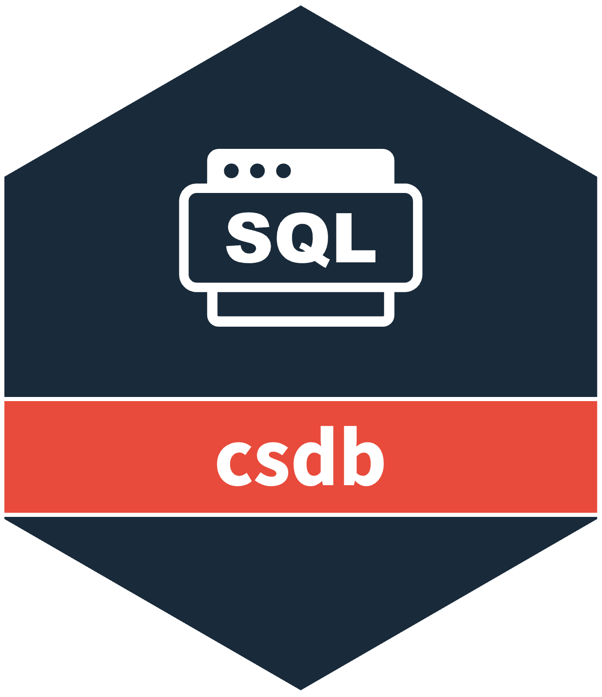

# csdb <a href="https://www.csids.no/csdb/"></a>

## Overview 

[csdb](https://www.csids.no/csdb/) provides an abstracted system for easily working with databases with large datasets.

Read the introduction vignette [here](http://www.csids.no/csdb/articles/csdb.html) or run `help(package="csdb")`.

## csverse

<a href="https://www.csids.no/packages.html"></a>

The [csverse](https://www.csids.no/packages.html) is a set of R packages developed to help solve problems that frequently occur when performing disease surveillance.

If you want to install the dev versions (or access packages that haven't been released on CRAN), run `usethis::edit_r_profile()` to edit your `.Rprofile`. 

Then write in:

```
options(
  repos = structure(c(
    CSVERSE = "https://www.csids.no/drat/",
    CRAN    = "https://cran.rstudio.com"
  ))
)
```

Save the file and restart R.

You can now install [csverse](https://www.csids.no/packages.html) packages from our [drat repository](https://www.csids.no/drat/).

```
install.packages("csdb")
```
